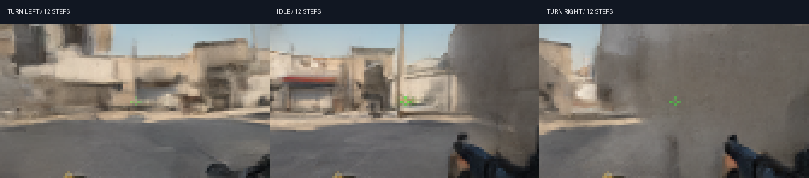

# CounterDream

**Train a small CS:GO world model from scratch, then play inside its predictions.**

CounterDream learns `recent frames + keyboard/mouse actions → next frame` on Dust II
gameplay. The viewer starts with four recorded seed frames. Every subsequent frame
is sampled by the neural model and fed back into its context. No CS:GO engine runs
behind the viewer.

This is a compact research experiment, not a full recreation of CS:GO. It has no
authoritative physics, multiplayer server, or guaranteed game rules. Low-resolution
generation, loss of detail, and long-rollout drift are expected limitations.

**Training status:** the second run is training on one H100. Its 10,000-step
checkpoint passed a local GPU browser playtest and reached **19.51 dB** held-out
next-frame PSNR, versus **18.61 dB** for repeating the previous frame. These are
early validation results; final weights and a release report are being prepared.



These branches use identical starting views and random noise. Only the requested
turn direction changes. [Early measurements](docs/reports/step-10000/evaluation.json)
· [Experiment record](docs/EXPERIMENTS.md) · [Model card](docs/MODEL_CARD.md)

## What is original here?

- A standalone 9,660,291-parameter conditional U-Net and EDM training/sampling code.
- Random initialization: no pretrained DIAMOND, GameNGen, or image/video weights.
- A resumable, bounded downloader for the public CS:GO action-labeled dataset.
- Episode-level train/validation splitting, EMA checkpoints, deterministic
  evaluation seeds, and optimizer/RNG state for resuming our own training.
- Autoregressive rollout videos, repeat-frame and shuffled-action baselines,
  counterfactual action branches, and a local browser viewer with local GPU or
  private Modal GPU inference.

EDM and DIAMOND are methodological references; this is not a claim to invent
diffusion world modeling. See [NOTICE.md](NOTICE.md) for attribution.

## Setup

Python 3.11 is recommended. A CUDA GPU is needed for useful training speed.
The viewer can also run locally on CPU, at reduced speed.

```bash
python -m venv .venv
# Activate the environment for your operating system.
python -m pip install -e ".[cloud,dev]"
modal setup
```

Keep Modal credentials in your environment or Modal profile. Never put them in
source files, notebooks, commits, browser JavaScript, or public issue reports.

## Train your own weights on Modal

```bash
# Downloads only 100 complete episodes from one Dust II archive.
# Uses byte ranges to skip previously committed episodes after interruption.
modal run --detach cloud.py::prepare --episodes 100

# One H100; random initialization; 60,000 optimizer steps or a 2-hour loop limit.
modal run --detach cloud.py::fit --run dust2-v2 --steps 60000 --max-seconds 7200

# Held-out predictions, autoregressive rollouts, counterfactuals, seeds and metrics.
modal run --detach cloud.py::assess --run dust2-v2 --latest
```

`--detach` keeps the remote job alive if the local client disconnects. The job's
Modal URL is printed at launch. Do not start another writer for the same run while
the original is still active. The volume is `counterdream-artifacts-v1`.

To resume an interrupted run, use the same command with `--resume`. This restores
the model, EMA, optimizer, and random-number states. Changing the total step target
also changes the learning-rate schedule. The latest checkpoint is saved every
1,000 steps and at the run's wall-time boundary.

See [docs/BUDGET.md](docs/BUDGET.md) before allocating compute. This project's
bounded jobs do not configure or replace an account-wide Modal billing limit.

## Play

After training and evaluation, download the compact inference weights and seed views:

```bash
modal volume get counterdream-artifacts-v1 runs/dust2-v2/evaluation/model.pt artifacts/model.pt
modal volume get counterdream-artifacts-v1 runs/dust2-v2/evaluation/seeds.npz artifacts/seeds.npz

# Local GPU, or CPU if CUDA is unavailable:
python -m counterdream.serve --checkpoint artifacts/model.pt --seeds artifacts/seeds.npz

# Alternatively, authenticated Modal L4 inference with a local browser viewer:
modal run cloud.py::play --seeds artifacts/seeds.npz
```

Open **http://127.0.0.1:7860**. Move with WASD; turn with arrow keys or mouse drag;
fire with F or left click; jump with Space; reload with R; pause with Escape.
Reset returns to the selected recorded starting view. Pause and an unfocused
browser stop requesting new frames. Each viewer process has a 2,000-generated-frame
limit. There is no public unauthenticated GPU endpoint.

## Architecture and data

| Component | Configuration |
|---|---|
| Output | 112 × 64 RGB, pixel-space diffusion |
| Visual context | 4 frames |
| Actions | 4 × 51 multihot keyboard/mouse values |
| U-Net widths | 64, 128, 192, 256 |
| Attention | Bottleneck, four heads |
| Conditioning | Noise levels + action history, residual scale/shift |
| Objective | EDM-preconditioned denoising with context noise augmentation |
| Temporal training | Alternating two-step unrolling after step 2,000 |
| Optimizer | AdamW, warmup + cosine decay, gradient clipping, EMA |
| Sampling | Karras noise schedule, Euler integration, normally 8 steps |
| Data split | 90,000 training frames; 10,000 validation frames |

Each source file has 1,000 consecutive frames. Every tenth complete source episode
is reserved for validation **before** temporal windows are formed. A window never
crosses a source-file boundary. This measures held-out episodes on the same map,
not unseen maps or independently collected sessions. Nearby source episodes can
share locations and visual content.

The dataset loader converts the source BGR images to RGB and uses action `a[t]`
with frame `x[t]` to predict `x[t+1]`, following the reference's alignment. The
manifest records the exact Hugging Face revision, source members, and SHA-256
hashes. Raw archives are neither checked into Git nor downloaded in full.

## Evaluation

Run `python -m counterdream.evaluate --checkpoint ... --data ... --output ...`
or the Modal command above. It produces:

- A fixed-seed, 256-frame held-out one-step evaluation.
- A previous-frame baseline and a shuffled-action baseline with matched noise.
- Four 64-frame autoregressive videos: ground truth / model / repeated seed frame.
- MSE and PSNR at horizons 1, 4, 8, 16, 32, and 64.
- Left/idle/right branches from identical seed frames and random noise.
- Measured inference latency, checkpoint step, and portable seed frames.

PSNR can favor blur. Shuffled-action error and visually distinct branches do not,
by themselves, prove correct game physics. Inspect the videos and failure cases.
The first run's periodic monitor used a different initial noise scale from the
corrected release sampler. Release checkpoints are measured separately with the
corrected sampler; see [the experiment record](docs/EXPERIMENTS.md). Evaluation
uses more windows from the same validation split and is not an independent test set.

## Develop

```bash
python -m pytest tests -q
```

The tests check gradients, conditioning connectivity, deterministic sampling,
checkpoint loading, action encoding, temporal boundaries, autoregressive feedback,
input validation, and viewer limits. Cloud jobs are not launched by tests or CI.

Code: MIT. Dataset, game imagery, trademarks, and dependencies retain their
respective rights. See [NOTICE.md](NOTICE.md).
