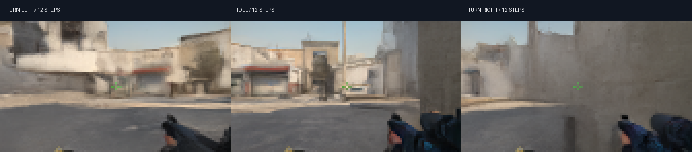

# CounterDream

[](https://github.com/OmuNaman/counterdream/actions/workflows/tests.yml)

**A small CS:GO world model, trained from scratch. Play inside its predictions.**

The [five-H100 scale experiment](docs/SCALE_V3.md) has prepared 5.688 million frames
and verified cloud streaming. Modal disabled the workspace during the full run's
data loading; optimization had not started and the run is stopped. The released
results below describe v0.1.0; improved v3 quality is not yet established.

CounterDream learns recent frames + keyboard/mouse actions → next frame from Dust II
gameplay. The viewer starts with four recorded seed frames. Every subsequent frame
is generated by the neural model and fed back into its context. No CS:GO game engine
runs behind the viewer.

**Training completed:** 60,000 steps. **Released checkpoint:** 30,000 steps.
9.66M parameters · 90,000 training frames ·
112 × 64 RGB · 19.98 dB validation PSNR, versus
18.61 dB for repeating the previous frame.



[Download weights and videos](https://github.com/OmuNaman/counterdream/releases/tag/v0.1.0)
· [Measured results](docs/RESULTS.md) · [Model card](docs/MODEL_CARD.md)
· [Training history](docs/EXPERIMENTS.md) · [References](docs/REFERENCES.md)

The checkpoint at 30,000 steps had lower next-frame validation error than the final
state at 60,000. The release uses that checkpoint for play and includes the full
final state for further training. Both evaluations are documented.

This is a compact research experiment. Generated geometry and weapon details can
drift during short rollouts. It has no authoritative physics, health/inventory
logic, multiplayer server, or guaranteed game rules. It does not match the scope
or quality of the full DIAMOND or GameNGen systems.

## Play the released model

Use Python 3.11 or 3.12 and a CUDA-enabled PyTorch installation. The
[Windows and Linux setup guide](docs/LOCAL_SETUP.md) gives complete commands using
the tested PyTorch 2.6 / CUDA 12.4 environment. CPU inference is much slower.

```bash
git clone https://github.com/OmuNaman/counterdream.git
cd counterdream
python -m pip install -e .
python -m counterdream.download
python -m counterdream.serve --checkpoint artifacts/model.pt --seeds artifacts/seeds.npz
```

Open **http://127.0.0.1:7860**, then **Connect & Play**. Move with WASD; turn with
arrow keys or mouse drag; fire with F or left click; jump with Space; reload with R;
pause with Escape. Reset returns to the selected recorded starting view. Inputs
are requests to the learned model, not guarantees of correctly simulated mechanics.

The downloader verifies pinned sizes and SHA-256 hashes. The playing checkpoint
is about 39 MB. **Local play needs no API key, Modal account, or CS:GO installation.**
The viewer targets at most 16 generated frames per second when the GPU permits.
Pause and an unfocused browser stop requesting new frames. Each local server
session allows 2,000 generated frames; restarting the server begins another session.

The release also includes the full `training-step-60000.pt` state with model,
EMA, optimizer, and random-number states, plus four evaluation videos and checksums.

## Train your own weights on Modal

```bash
python -m pip install -e ".[cloud,dev]"
modal setup

# 100 complete source episodes, pinned revision, resumable bounded range reads.
modal run --detach cloud.py::prepare --episodes 100

# One H100, random initialization, at most 60,000 steps / two-hour loop allowance.
modal run --detach cloud.py::fit --run dust2-v2 --steps 60000 --max-seconds 7200

# Evaluate the actual final state and export the exact measured EMA checkpoint.
modal run --detach cloud.py::assess --run dust2-v2 --latest
modal run cloud.py::fetch --run dust2-v2 --destination artifacts/dust2-v2

# Optional private L4 inference; browser and credentials stay on your computer.
modal run cloud.py::play --seeds artifacts/dust2-v2/evaluation/seeds.npz
```

Wait for each dependent job to complete before running the next command. `--detach`
keeps a remote job alive if your local client disconnects. Use the printed Modal
App URL to inspect or stop that job. See [compute limits](docs/BUDGET.md) before
allocating resources. These limits do not replace an account-wide billing cap.

The private viewer prefers `runs/dust2-v2/release/model.pt` if present in the
volume, otherwise it loads `runs/dust2-v2/evaluation/model.pt`. Upload a different
evaluated checkpoint to the release path when you want to change that selection.

The volume is `counterdream-artifacts-v1`. To resume an interrupted run, add
`--resume` with a target larger than the saved step. Do not start another writer
until the previous one has stopped. Checkpoints are saved every 1,000 steps and
at the training loop's wall-time boundary. Increasing the target changes the
cosine learning-rate schedule. Keep credentials in a Modal profile or environment,
never in source files, browser JavaScript, or commits.

## Architecture and provenance

| Component | Configuration |
|---|---|
| Output | 112 × 64 RGB, pixel-space diffusion |
| Context | 4 frames and 4 × 51 keyboard/mouse action values |
| Model | Conditional U-Net, widths 64 / 128 / 192 / 256 |
| Attention | Four heads at the bottleneck |
| Conditioning | Noise levels + action history, residual scale/shift |
| Objective | EDM denoising, context noise augmentation, short unrolling |
| Optimizer | AdamW, warmup + cosine decay, clipping, EMA |
| Sampling | Karras noise schedule, eight Euler steps, sigma_max 20 |
| Data | 90,000 training frames; 10,000 validation frames |

Every tenth complete 1,000-frame source file is held out before temporal windows
are formed. Windows never cross source-file boundaries. This is a same-map,
same-collection validation split; neighboring files may share locations. The
manifest records the immutable dataset revision and original source-file hashes.

The implementation is standalone and its weights were randomly initialized. No
pretrained DIAMOND, GameNGen, or other image/video model weights were used. EDM and
DIAMOND are methodological references, not inventions claimed by this project.
See [NOTICE.md](NOTICE.md) for dataset and method attribution.

## Evaluation and development

Evaluation includes 256 fixed-seed one-step windows, repeat-frame and matched-noise
shuffled-action baselines, four 64-frame autoregressive clips, and left/idle/right
branches from identical starting views and noise. Sampling and model selection
used this validation split, so these are not untouched test-set results.
PSNR can favor blur; inspect all videos and documented failures.

```bash
python -m pytest tests -q
```

Tests cover gradients, action conditioning, checkpoint loading, temporal boundaries,
generated-frame feedback, control validation, session limits, and release-download
integrity. Tests and GitHub Actions never allocate cloud GPUs.
[Contributing](CONTRIBUTING.md).

Code and model weights: MIT. Dataset, game imagery, trademarks, and dependencies
retain their respective rights. This is an unaffiliated research project.
