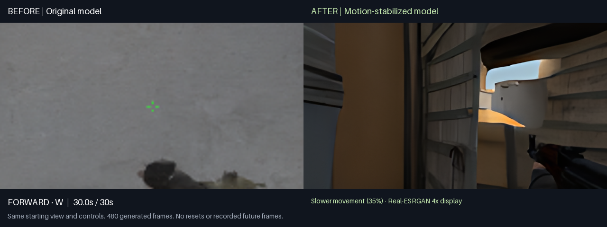
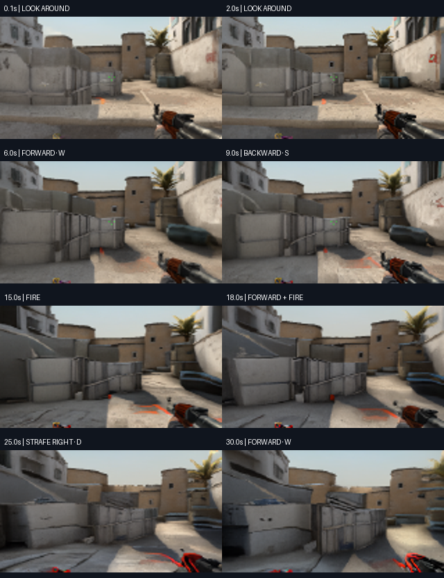

# September 10 demonstration upgrade

The motion-guided version retained a recognizable scene and weapon through two
continuous 30-second movement sequences. The original 60,000-step model lost scene
structure in the matched baseline. This is a better short demonstration, with
slower movement; it is not a reliable CS:GO simulator. Firing remains weak,
geometry can stretch, and game rules and hit detection are not established.



## What runs

- Our 61.8M-parameter diffusion model at 20,000 training steps, selected using
  validation previews. No external world-model weights.
- A new 258,533-parameter motion predictor, trained from random weights. It
  proposes a pixel displacement and residual before each diffusion prediction.
- Learned motion scaled to 35% of its original magnitude, followed by four Euler
  denoising passes with a warm start, `sigma_max=0.3`, and context noise 0.03.
  The slower motion is a deliberate tradeoff for this demonstration.
- Real-ESRGAN general-x4v3 expands 160 × 88 to 640 × 352 for display only. Its pretrained
  weights are credited separately and never fed into the world model.

After eight recorded starting frames, every subsequent frame is generated and
fed back into the model. There are no automatic resets, recorded future frames,
hidden gameplay videos, or game engine. The browser has WASD, look, fire, reload,
jump, pause/reset, adjustable look speed, fullscreen, and a 30-second WebM recorder.

## Observed results

The saved offline comparison contains 480 generated frames at 16 fps, exactly 30 seconds,
using identical starting views and requested controls. It includes forward,
backward, turning, firing, strafing, reload and jump inputs. A second courtyard
sequence also retained recognizable scenery through 480 frames, with some drift.
These views and settings were selected after inspecting multiple validation
trials. This is not an unseen-test-set claim or a general playability score.



An actual A100 40GB stream delivered 480 frames in 31.86 seconds. Excluding the first
eight frames, it delivered 15.37 fps, with 48.45 ms median GPU generation/display time,
438.82 ms median input-to-displayed-frame response, and 1,633.88 ms p95. Placement was
`us-ashburn-1`; these figures are a single measured connection, not a latency
guarantee. Its control schedule used wall time, and metadata recorded which
controls the GPU applied. [Measurement](reports/demo-upgrade/cloud-check.json).

The motion predictor trained on 4,096 three-frame windows sampled from 128 original
training episodes. An internal holdout grouped by source recording contained 480
windows; 3,616 were used for optimization. The 5,000-step run took 45.40 seconds on one A100,
peaked at 1.30 GB of GPU allocations, and selected step 4,500. Its best held-out
next-frame MSE was 0.009937 versus 0.014281 for repeating the previous image
(30.4% lower). These are internal motion-model metrics, not the v3 validation
protocol, and do not prove long-horizon quality. Original validation and test
recordings were excluded from this auxiliary training; the final v3 test remains
untouched. [Training report](reports/demo-upgrade/motion-training.json).

Matched-noise forward, backward, look-left, look-right, and fire requests each
produce different predictions from idle. Firing's visual change is small.
[Control images](reports/demo-upgrade/controls.png) and
[metrics](reports/demo-upgrade/controls.json) demonstrate sensitivity to actions;
they do not establish correct mechanics.

## Reproduce

The preview release includes the exact demo bundle and videos. Use the source
at the release tag, or the `codex/csgo-scale-five-h100` branch, with CUDA-enabled
PyTorch 2.6 and Python 3.11/3.12. Keep the five bundle assets and `bundle.json`
together; both entrypoints verify their hashes.

[Download the demo bundle and before/after videos](https://github.com/OmuNaman/counterdream/releases/tag/v0.3.0-demo).
Extract `counterdream-v3-demo.zip` under `artifacts/` to create
`artifacts/demo-bundle/`. The archive includes both model weights, starting views,
display weights, their checksums, and licenses.

```sh
python -m pip install -e .
python -m counterdream.play_demo --bundle artifacts/demo-bundle
```

Open `http://127.0.0.1:7860/`. Select the first doorway or fifth courtyard view and
four prediction passes. Use short movements; reset explicitly if the scene drifts.
Local play needs no Modal key. For the same bundle on a separate, bounded A100:

```sh
python -m pip install -e '.[cloud]'
modal setup
modal volume put counterdream-artifacts-v1 artifacts/demo-bundle runs/dust2-v3-full/demo-upgrade-v1
modal run cloud_stream.py::play --variant demo
```

GPU allocation begins on browser connection. It stops after 90 idle seconds and
has a fixed 30-minute allocation window, at most three starts within that window,
and a 12,000-frame budget per GPU worker. Reconnecting does not extend the window.
Recurring training monitoring remains paused; the five-H100 training is complete.

To reproduce the auxiliary training against the already-prepared corpus:

```sh
python -m pip install -e '.[cloud,experiments]'
modal run cloud_motion.py::prepare
modal run cloud_motion.py::fit
```

Data preparation uses a CPU worker, with a 1,200-second timeout. The training
function has one A100, no retries, and a 720-second hard timeout; the loop stops
at 5,000 steps or 600 seconds. Completed outputs are reused. The CLI entrypoints in
`counterdream.demo_record`, `demo_controls`, `demo_compare`, and
`demo_stream_check` create fresh outputs and preserve existing recordings.

## Experiments retained for inspection

Twenty-one short sampler/detail trials were followed by 30-second comparisons.
Low-noise warm starts alone stayed sharp while suppressing motion; Heun variants
produced artifacts; optical-flow detail feedback blurred further. Neither the
20k checkpoint with context noise alone nor gentler scripted movements alone
solved the collapse. The motion model alone blurred; full-strength motion plus
diffusion distorted geometry. Reduced learned motion plus diffusion gave the
selected demonstration. Optional action-centered motion remains an experiment,
not the selected live profile. The baseline recording predates these changes.

The final comparison changes the checkpoint, motion proposal, sampler and
display together; it does not isolate the effect of upscaling. Saved native-frame
arrays and reports distinguish generation from display enhancement.

## Attribution

The compact display network and weights come from
[Real-ESRGAN](https://github.com/xinntao/Real-ESRGAN), by Xintao Wang and contributors,
under the included BSD-3-Clause license. Display weight SHA-256:
`8dc7edb9ac80ccdc30c3a5dca6616509367f05fbc184ad95b731f05bece96292`.
Learned pixel-motion prediction is informed by
[Finn et al., 2016](https://arxiv.org/abs/1605.07157); our small motion model is trained
from scratch using OpenCV DIS flow supervision. See the existing
[references](REFERENCES.md) for DIAMOND, GameNGen, and dataset attribution.
