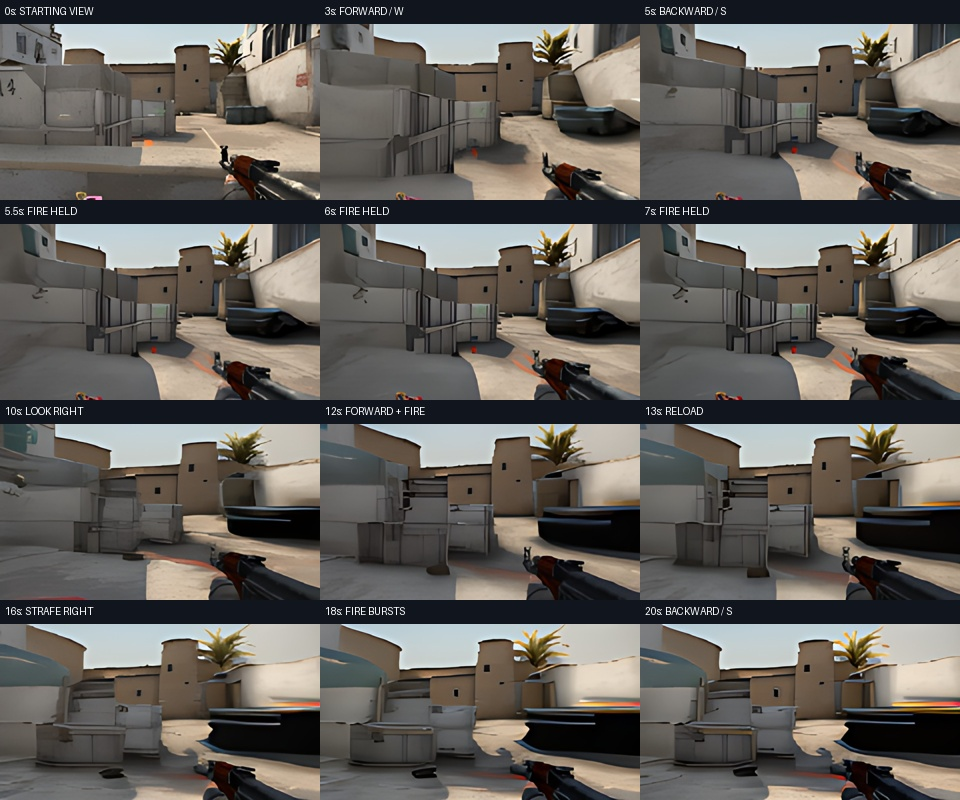
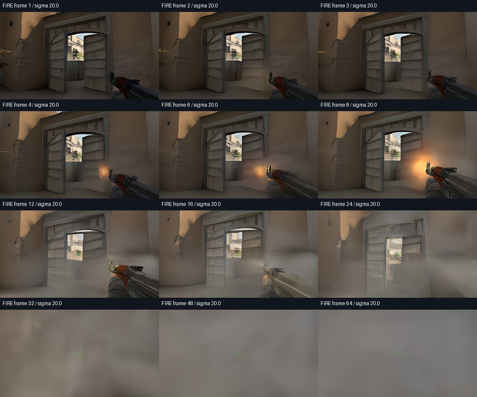

# H100 preview: stronger movement, measured speed, remaining firing limits

The H100 viewer delivered **22.25–23.67 generated frames per second** in two
20-second live captures. The previous A100 demonstration delivered 15.37 fps.
This update removes the 35% motion reduction and adds a 24 fps target. It does
not establish reliable shooting, navigation, or game rules.

[Download the exact bundle and recordings](https://github.com/OmuNaman/counterdream/releases/tag/v0.3.1-h100).



## What changed

- Inference now defaults to one H100. `COUNTERDREAM_GPU` can select A100, H100 or H200.
- The motion proposal uses scale 1.0 and subtracts motion predicted for an idle
  action. The original 35%-motion demo bundle remains available unchanged.
- The viewer has **Native · 16 frames/s** and **Fast · up to 24 frames/s** modes.
  Fast mode generates extra model steps, advancing model time 1.5× relative to
  its 16 fps training cadence. This can accelerate both movement and drift.
- The new recorder captures received frames first and encodes them afterward.
  Playback follows their original arrival timestamps, holding the last image
  during gaps. Its 30 fps video container does not mean 30 generated frames/s.
- A software restart can retain the original absolute allocation deadline.

The diffusion weights (61.8M parameters at 20,000 training steps), auxiliary
motion weights and starting views are unchanged. This is an inference update,
with no new training. Four Euler passes, sigma maximum 0.3 and context noise 0.03
remain selected. Real-ESRGAN enlarges native 160 × 88 predictions to 640 × 352 for
display; only native predictions enter the next model context.

## Measurements

| Capture | Mode | Generated frames | Wall time | Delivered fps* | Median generation/display | Median input response | p95 input response |
|---|---|---:|---:|---:|---:|---:|---:|
| H100 doorway | Native | 306 | 20.00 s | 15.83 | 31.3 ms | 317 ms | 365 ms |
| H100 doorway | Fast | 427 | 19.995 s | 22.25 | 31.4 ms | 341 ms | 654 ms |
| H100 courtyard | Fast | 459 | 20.009 s | 23.67 | 30.5 ms | 297 ms | 470 ms |

*Delivered fps excludes the initial eight generated frames. Total frames divided
by total time includes startup/control transit and is slightly lower. These are
single-session observations, not a latency guarantee. The H100 identified itself
as `NVIDIA H100 80GB HBM3`; the provider's location label was `odin`.

The earlier A100 result used a different profile and placement, so the comparison
does not isolate hardware alone. Median rendering decreased from 48.45 ms to
roughly 31 ms. Raising the old 16 fps application cap enabled most of the measured
frame-rate increase. Network response still takes about 0.3 seconds.

Reports: [native](reports/h100-preview/native.json),
[doorway fast](reports/h100-preview/doorway-fast.json),
[courtyard fast](reports/h100-preview/courtyard-fast.json).
Each capture begins with eight recorded context frames and then generates every
frame. There are no resets inside a capture, interpolated frames, or injected
future gameplay. Stored input records identify the last control message received
by the server; mouse deltas can accumulate between generated frames.

## Firing: a real limitation

The live clips send fire at approximately 5–7 seconds, forward + fire at
10–12 seconds, and bursts at 17–19 seconds. They also send reload, strafe and
jump. Those labels describe inputs, not a claim of correct mechanics.

The stabilized version still has a weak firing animation. An unconstrained
sigma-20 test produces visible muzzle flashes in the doorway view around frames
4–8, then loses the gun and scene within seconds. Its separate four-second
recording is an offline H100 diagnostic at 16 fps, not part of the live capture.



Four movement profiles and eight firing settings were inspected. Increasing
action contrast did not fix firing. Two experiments blended an additional model
prediction over a soft weapon region; both damaged the scene and were rejected.
Their code is retained for reproducibility and **is not enabled in the released
profile**. The bundle has no weapon sprites, synthetic flash overlays or game
engine. Strong movement still bends geometry; a convincing sustained shooter
has not been achieved.

## Reproduce

Use source tag `v0.3.1-h100` and CUDA-enabled PyTorch 2.6. Extract the released zip
under `artifacts/`. For local inference:

```sh
python -m counterdream.play_demo --bundle artifacts/h100-responsive-bundle
```

For the H100 cloud viewer, after configuring your own Modal credentials:

```sh
modal volume put counterdream-artifacts-v1 artifacts/h100-responsive-bundle runs/dust2-v3-full/demo-responsive-v1
modal run cloud_stream.py::play --variant responsive
python -m counterdream.live_record --output artifacts/my-h100-capture --spawn 4 --seconds 20 --fps 24
```

GPU allocation begins on connection, stops after 90 seconds idle, and has a fixed
30-minute maximum. It is separate from the completed five-H100 training run.
[Modal GPU configuration](https://modal.com/docs/guide/gpu) and
[current usage pricing](https://modal.com/pricing).

`cloud_playtest.py` contains bounded comparison, firing and weapon-region trials.
Their output folders are deliberately immutable; an existing folder stops a
repeat run. Use a new output name in the experiment source to repeat a trial.

Validation: 40 automated tests passed, browser JavaScript syntax passed, the
viewer loaded the H100 and new pace control, and both live videos were decoded
and visually inspected. These software checks do not prove game quality.
