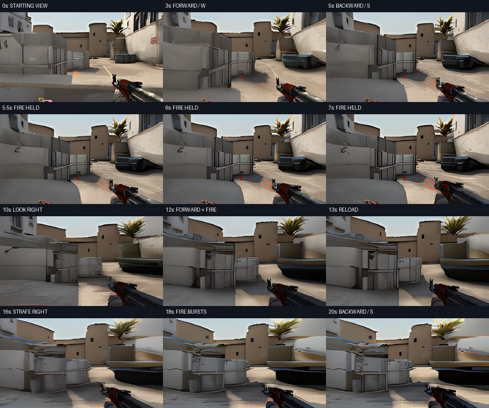
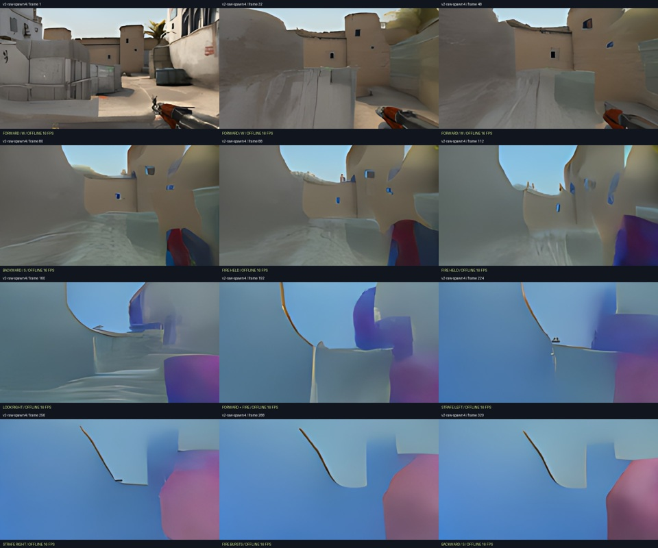
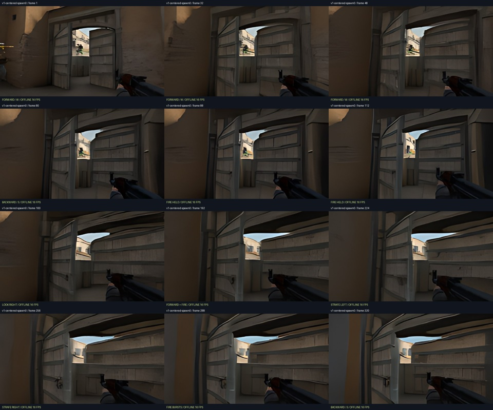

# Controls and playability pass — September 10

The viewer now sends keyboard and button changes immediately, keeps short taps
until one model step consumes them, and displays the actions acknowledged by the
cloud. A bounded decoder keeps only the newest pending image and paints on the
browser's display clock. Old-world frames cannot appear after a reset. The game
uses the full available width on laptop layouts; the settings sit underneath.

These fixes improve interaction and prevent avoidable stalls. **The model still
does not provide reliable navigation, shooting, or a coherent 20–30 second game.**
The live bundle remains the previously released 20k diffusion checkpoint and
MotionPredictor-v1, with the responsive profile. No pretrained world-model weights,
game engine, recorded future frames, or firing overlays were substituted.

## Viewer changes

- W/A/S/D, F, jump and reload changes go out immediately. Mouse deltas are consumed
  once; held arrow-key look is applied once per generated frame, independently of
  heartbeat and keyboard event rates.
- A press and release arriving while the GPU is busy still produces one action.
  Releases, pause and focus loss clear held controls.
- Left-click fires; right-drag looks. Mouse capture provides free look where the
  browser supports Pointer Lock. Arrow keys and visible hold buttons remain available.
- Pause displays an explicit Resume overlay. Settings return keyboard focus to
  the world. Controls stay disabled while the first frame is loading.
- A single pending compressed frame and single decoder bound client work during
  network bursts. Decoded images and their action metadata stay paired.
- Display FPS and control-to-displayed-frame latency replace misleading instant
  inter-frame intervals. The last acknowledged action remains visible for diagnosis.
- JPEG quality 88 / 4:2:0 replaces quality 90 / 4:4:4. Recompressing every 30th frame
  from the prior 459-frame live capture reduced mean packet size from 40,111 to 31,561
  bytes (21.3%), with 44.36 dB mean PSNR relative to the previous JPEGs. This is a
  compression experiment, not evidence of better learned dynamics.

The Python stream tests and JavaScript client tests cover short taps during a busy
GPU, release, held look, immediate keyboard sends, focus loss, decoder failures,
bursts of 100 frames, and resets during decoding. **44 Python and 8 JavaScript tests
passed.** Browser tests confirmed W/S, fire, jump, the movement buttons, pause,
and restored keyboard focus after changing a setting. Mouse capture support is
browser-dependent; right-drag and arrow keys are the fallback.

An Asia-Pacific H100 startup probe did not produce a ready GPU within 120 seconds;
its pending invocation was cancelled. The working unconstrained location remains
the default. Region availability is not a guarantee of lower network latency.

## Final live capture

The final H100 stream delivered 455 frames in 19.99 seconds, with 23.73 generated
frames/s after startup. Median control-to-arrival latency was 336 ms and p95 was
386 ms; median inference/rendering took 37.1 ms. This allocation ran in us-west4.
These measurements do not establish a network-latency improvement over prior
allocations. The clip preserves wall-clock arrival timing; its 30fps video
container holds each frame until the next generated frame arrives. There is no
interpolation, automatic reset or inserted future gameplay.

See [the full measured report](reports/playability-pass/live-stream.json).

## New movement model: tested, not promoted

`cloud_motion_v2.py` trains a 1.116M-parameter motion model from random weights with
explicit current-action features, spatial coordinates and a four-prediction
training unroll. Data: 5,760 ten-frame windows from 176 clean expert and 64 other
episodes, all in the original training split. Internal training and validation windows are grouped by source episode.

Training used 4,968 windows and selected checkpoints with 128 fixed windows from
the 792-window internal holdout. The 10,000-step run took 328.54 seconds on one H100;
the selected checkpoint is step 9,800. The final v3 test split was never read.
Dataset revision/index, history and checkpoint hash are in
[the reports](reports/playability-pass/decision.json).

On the same 128 windows, mean squared pixel error averaged over horizons 4–8 fell
from 0.02514 for raw v1 to 0.01965 for raw v2 (21.8%). These horizons span at most
half a second. The live v1 profile additionally subtracts predicted idle motion;
its error on this comparison is 0.02749.

Six matched 20-second tests used the same diffusion weights, noise schedule,
controls and two saved starting views: v1 centered, v2 raw, and v2 centered.
The v2 raw model advances visibly but rapidly stretches scenery and loses the
weapon. Centering weakens movement and still distorts the gun and geometry.
**Lower short-horizon error did not translate into sustained playability, so v2
is excluded from the live profile.** An initial evaluation attempt was interrupted
by reuse of an old session sequence; the completed comparison clears session
state between every trial.

Full numeric results are in [motion-comparison.json](reports/playability-pass/motion-comparison.json).
These are offline 16 fps videos of generated frames, not live latency benchmarks.
The source and rejected experiment are preserved for reproducibility.

## References

- [Original CS:GO data and its expert subset](https://huggingface.co/datasets/TeaPearce/CounterStrike_Deathmatch)
- [Modal region selection](https://modal.com/docs/guide/region-selection)
- [Existing H100 model and display-upscaler attribution](H100_PREVIEW.md)
