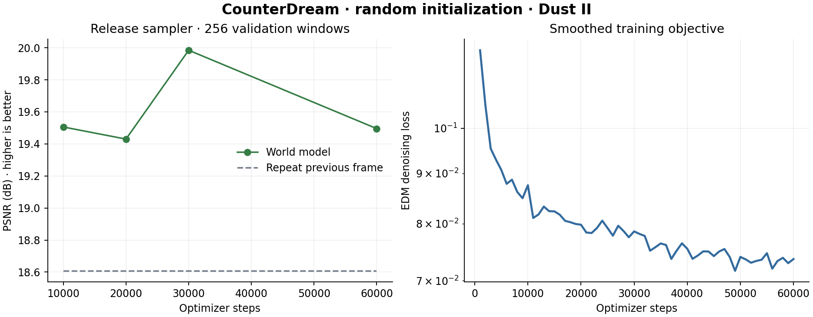

# Release v0.1.0 — measured results

CounterDream completed **60,000 optimizer steps from random initialization**
on one NVIDIA H100 80GB HBM3. The released EMA checkpoint is step **30,000**.
It had lower next-frame error than the final state at step 60,000, which measured
19.495 dB on the same 256 windows. Both are available: the selected checkpoint for
play, and the full final training state for continuation. See the
[final-state evaluation](reports/step-60000/evaluation.json).
Training used **90,000 frames**, with **10,000 frames** reserved by source file for
validation. There are **9,660,291 parameters** and output is **112 × 64 RGB**.
No pretrained model weights were imported.

## One-step prediction

Fixed-seed evaluation on 256 validation windows, eight Euler sampling steps,
sigma_max 20. MSE uses RGB in [0,1]; PSNR is computed from aggregate MSE.

| Method | MSE ↓ | PSNR dB ↑ |
|---|---:|---:|
| CounterDream | 0.010036 | 19.98 |
| Repeat previous frame | 0.013778 | 18.61 |
| CounterDream with shuffled actions | 0.015972 | 17.97 |

The model's mean next-frame error is **27.2% lower** than repeating the
previous frame. Shuffled action histories use the same sampling noise. Their
higher error is evidence of action dependence, not proof of correct game physics.

## Autoregressive rollout

Four recorded seed contexts, then 64 model-generated frames per clip. Each generated
frame becomes part of the next input. Only the recorded control sequence is supplied
after initialization. The repeat baseline holds the final seed frame fixed.

| Generated-frame horizon | Model MSE ↓ | Repeat-seed MSE ↓ | Model PSNR dB ↑ |
|---|---:|---:|---:|
| 1 | 0.004998 | 0.011036 | 23.01 |
| 4 | 0.019881 | 0.026430 | 17.02 |
| 8 | 0.026733 | 0.035612 | 15.73 |
| 16 | 0.039061 | 0.038051 | 14.08 |
| 32 | 0.039227 | 0.061222 | 14.06 |
| 64 | 0.042275 | 0.073698 | 13.74 |

Results average four clips and are a small diagnostic, not a general reliability
estimate. [All four videos are release assets](https://github.com/OmuNaman/counterdream/releases/tag/v0.1.0).
Their columns are held-out gameplay / model prediction / repeated seed frame.
Playback is eight fps for inspection. Long rollouts can drift toward walls, soften
textures, and lose weapon identity. These failures remain visible in the release.

These branches share the same four seed frames and sampling noise. Only the turn
input differs. Pixel difference is not a substitute for evaluating geometric accuracy.

## Performance and provenance

- Median sampling latency: **47.2 ms / frame**
  (**21.2 fps**) on the named H100. This excludes
  browser display and network transport.
- Training loop, loading, validation, and checkpoint export: **61.3 minutes**.
  Container startup and prior experiments add time.
- PyTorch: **2.6.0+cu124**. The local browser viewer was also
  tested on Windows with an RTX 4070 Laptop GPU.
- Checkpoint SHA-256: `22dc9612eb98e66bbf86e1f91a39b56a2e35af6beb30d995e65133974066285a`.
- [Machine-readable evaluation](reports/step-30000/evaluation.json),
  [training completion](reports/complete.json), [source hashes](reports/run.json),
  [data manifest](reports/data-manifest.json), and [action coverage](reports/data-coverage.json).

The figure's validation points use the same release sampler. The archived
[periodic training monitor](reports/periodic-metrics.jsonl) used sigma_max 5 and
must not be interpreted as the release sampler's accuracy. The automatic
`best_step` in the completion record refers to that legacy monitor; the released
weights are the separately evaluated snapshot at step 30,000.

## Scope of the claim

Sampler settings and checkpoint choices were tuned on this validation split.
It is not an untouched test set. The data comes from one map and collection, and
neighboring source episodes can share locations. PSNR can favor blurry predictions.
Sparse jump/reload examples and zero held-out crouch frames limit mechanic-specific
claims. This is a compact learned simulation experiment, not a complete CS:GO game.

See the [model card](MODEL_CARD.md), [experiment history](EXPERIMENTS.md), and
[compute accounting](BUDGET.md) for details.
