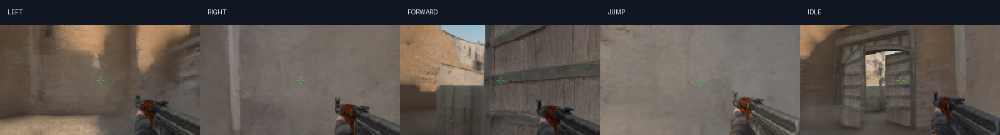

# Five-GPU CS:GO experiment

Status: **full five-H100 training completed 60,000 steps**.
It started on 2026-09-09 at 09:38:37 UTC from clean commit
`b8240b2ccfd1b139b46a3da100b69ed1832c2693`, with an absolute allocation deadline
of 15:08:37 UTC. The run finished in 14,217.45 seconds (3 hours 57 minutes),
before that deadline. All five final model hashes agree, and the complete
989,531,190-byte checkpoint was downloaded and verified. Peak memory reported by rank zero
is 67.74 GB, with roughly 0.225 seconds per training step. These are observed
training measurements, not a claim of playable quality.

Validation previews through 60,000 steps show recognizable scenes,
weapons, and responses to controls. Turning still blurs and longer generated
sequences drift or lose scene structure. Eight denoising passes retain more
texture in some sequences than four, but can increase pixel error and nearly
double inference time. Both settings remain candidates for later visual review;
lower pixel error alone does not establish better gameplay. The final test split
has not been evaluated. The 50,000-step preview does not establish a clear
improvement in sustained playability over the earlier previews. Inspected
sequences still lose objects, change weapon appearance, and drift into
inconsistent views after the initial frames.

The following eight-pass evaluations use the same 256 one-step validation
windows and six 128-frame generated sequences. They differ from the smaller
four-pass validation check used during training. Errors are pixel MSE on [0, 1]
images; smaller values need not mean sharper images or more consistent gameplay.

| Checkpoint | Next-frame MSE | Frame-128 MSE | Median generation time |
| --- | ---: | ---: | ---: |
| [10,000](reports/v3-validation-step-10000-8.json) | 0.01274 | 0.06593 | 45.8 ms |
| [20,000](reports/v3-validation-step-20000-8.json) | 0.01209 | 0.06747 | 46.2 ms |
| [30,000](reports/v3-validation-step-30000-8.json) | 0.01436 | 0.06663 | 56.3 ms |
| [50,000](reports/v3-validation-step-50000-8.json) | 0.01531 | 0.06374 | 46.0 ms |
| [60,000](reports/v3-validation-step-60000-8.json) | 0.01911 | 0.06734 | 48.5 ms |

Generation times are measurements from individual cloud GPU sessions, excluding
network delivery. Reports include checkpoint hashes, sampling settings, dataset
counts, and evaluation-source hashes. No checkpoint has been selected for a v3
general-purpose release yet. The [demo upgrade](DEMO_UPGRADE.md) uses 20k weights
with learned motion guidance for selected short demonstrations.

At 50,000 steps, next-frame error is higher than at 30,000 while frame-128
error is slightly lower. The images remain unstable, so this mixed numerical
change is not evidence of better sustained gameplay. The following control
comparison shows generated frame 16 for left, right, forward, jump, and idle,
starting from identical recorded frames and using identical sampling noise.



The workspace passed its training check and complete corpus transfer.
All 5,688 recordings transferred (241,422,928,128
bytes of arrays), and the rebuilt destination index matches the original SHA-256
exactly. No source files or training weights were modified or moved.
The check completed 128 optimizer steps in
50.76 seconds, with a four-frame memory check peaking at 25.17 GB and identical
model weights across all ranks. Its weights are not reused for full training.
See [the test report](reports/v3-workspace-check.json) and
[workspace migration details](WORKSPACE_TRANSFER.md).

The first full allocation was interrupted in the original workspace. Five H100s
started loading the completed corpus on 2026-09-09 at 08:18 UTC, then Modal stopped
the workers at 08:35 UTC. The API reported `workspace is disabled` without an
account-level reason. The app is confirmed stopped with zero tasks.
Optimization had not started, and this allocation produced no new trained
checkpoint. The short pilot, full dataset preparation, and streaming checks are
complete. Intermediate full-model validation previews are now available, but
improved playable quality has not been established.

The interrupted run used clean commit `fd5813cb6c1055922cde2c554c5db46ebef6a24b`.
Its original absolute allocation deadline was 13:48 UTC; no automatic replacement
allocation has been started. The approximately 17-minute allocation represents
about **$6.08 in estimated base GPU/CPU/RAM usage**, not verified billed spend or
total project cost. See [the interruption report](reports/v3-interruption.json).
The original prepared volume and allocation marker are retained. The user has
authorized a different active workspace and confirmed at least $130 of remaining
spend allowance there. Both attempts remain within the original project budget.

The user chose training from random initialization, with no DIAMOND or other
pretrained weights. v0.1.0 remains available unchanged as the original release.

## What changes

| | Released v0.1.0 | Scale experiment |
|---|---:|---:|
| Model parameters | 9,660,291 | 61,827,651 |
| RGB output | 112 × 64 | 160 × 88 |
| Visual history | 4 frames | 8 frames |
| Maximum training unroll | 2 frames | 4 frames |
| GPUs per training allocation | 1 H100 | 5 H100 |
| Prepared corpus | 100,000 frames | 5,688,000 frames |

The complete index contains **4,956,000 training frames**, **232,000 validation
frames**, and **500,000 test frames**. All 42 preparation partitions are complete.
Three byte-identical boundary recordings are counted once; two corrupt expert
recordings are excluded as documented below. The index checksum, source manifests,
action counts, and split counts are recorded in [the dataset report](reports/v3-data.json).

Eight-frame history is approximately half a second at the source recording rate.
It is not persistent spatial memory. Larger data and compute do not guarantee
stable physics, object identity, or indefinitely playable trajectories.

The dataset is pinned to revision
`265c6e5ac7aa335f58a2f2e864aad176fecfedde` in
[TeaPearce/CounterStrike_Deathmatch](https://huggingface.co/datasets/TeaPearce/CounterStrike_Deathmatch).
Its 28 main Dust II archives total 706,623,969,792 bytes. CPU workers process
bounded byte ranges directly into RGB uint8 arrays in a Modal Volume; the raw
archives are not copied to the user's laptop. Source episode SHA-256 values,
dimensions, split assignment, and action counts are recorded.
Two slow archives use four readers each. Their completed files are reused by
partition manifests, then counted once in the dataset index. No raw recording
is redownloaded merely to change its partition.
The expert Dust II archive contains 190 recording entries with cleaner control
labels. Two HDF5 entries (expert recordings 90 and 96) are truncated in the source archive. Such files
are excluded only after verifying their ZIP member length and CRC; their source
name, size, checksum, and exclusion reason remain in the dataset index. The
usable expert set contains 188,000 frames.
The sampler mixes 65% uniform episodes, 20% rare-action-weighted
episodes, and 15% expert episodes when expert data is available. Expert files
also have a separate deterministic validation split.

The published DIAMOND test-file list is excluded from training. An additional
deterministic 5% of remaining source files is validation. Files are not guaranteed
to represent independent play sessions, so this is not an unseen-session claim.
Sampler and checkpoint choices use validation only; final test results are
reported separately. Changing corpus size resets validation checkpoint selection.

The trainer uses one process per GPU with PyTorch DistributedDataParallel. Each
rank independently samples causal windows. The full run divides the training
episodes across five GPUs and loads each disjoint shard as uint8 observations;
approximately 40 GB of data per GPU leaves room for training activations.
Loading happens once before optimization, avoiding repeated random cloud reads.
The short pilot uses memory-mapped episode files. Rank weight checksums are
compared at each checkpoint, and per-rank RNG state is preserved for resume.
Training unrolls from one to four predictions and periodically replaces a
denoised training context with a fully sampled generated frame. The final
checkpoint is selected by validation rollout error across 16 clips at 8, 16, and 32 steps,
rather than one-step image error alone. Human inspection of videos is also
required: low pixel error can reward blur.
The step-zero evaluation is retained as an untrained baseline but cannot become
the selected trained checkpoint. EMA snapshots every 10,000 steps are also kept
for validation-based visual comparisons before any final test evaluation.

To inspect a saved milestone even when pixel-error selection still favors an
earlier checkpoint:

```powershell
modal run cloud_scale.py::assess --split val --steps 4 --checkpoint-step 10000
```

This reads `ema-step-10000.pt` and writes
`evaluation-val-4-step-10000`, preserving the default best-checkpoint evaluation.
The report records the actual checkpoint step and hash. Omitting the option
continues to evaluate `best.pt`.

## Cost and runtime bounds

Rates checked 2026-09-09 at [Modal pricing](https://modal.com/pricing).
Five H100s cost $19.746/hour GPU-only. With 20 CPU cores and 64 GiB memory,
the requested allocation is approximately $21.20/hour at base rates, before
network/storage/account-specific charges or credits.

The benchmark function has a 900-second hard timeout (about $5.30 maximum base
compute). The full training function has a 21,600-second hard timeout (about
$127.20 maximum base compute), with its loop limited to 19,800 seconds and
early checkpointing. It has no application-level automatic retries and records
a persistent marker preventing an accidental second full allocation. Modal can
restart preempted functions even with retries disabled: the same training input
can resume its checkpoint only within its original absolute allocation deadline.
The deadline does not restart with the container. Sixteen CPU workers can
prepare data concurrently; each call is limited to 3,600 seconds. The initial
preparation dispatch skips completed parts and uses one input per container,
preventing fast no-op inputs from skewing the scheduling of longer work. The
34-part invocation has roughly a $4.30 CPU/RAM bound before platform preemptions
or explicit resumptions; eight expert-data partitions add at most about $1.01
per invocation before retries.

These are application limits, not a Modal account spending cap. Existing project
spend was estimated below $15, not reconciled against an invoice. Reserve room
within the user's $200–$300 budget for data retries, evaluation, and inference.
GPU quantity is not a fivefold speedup guarantee; use measured distributed
throughput and dataset I/O to estimate runtime.

## Commands

```sh
modal run cloud_scale.py::prepare --shards 28
modal run cloud_scale.py::expert
modal run cloud_scale.py::index
modal run cloud_scale.py::benchmark --batch 12
modal run --detach cloud_scale.py::train --batch 12 --seconds 19800
modal run cloud_scale.py::assess --split val --steps 4
modal run cloud_scale.py::assess --split test --steps 4
modal run cloud_scale.py::fetch --weights
modal run cloud_stream.py::play
```

To try the current training checkpoint before release selection, run:

```sh
modal run cloud_stream.py::play --variant latest
```

This exports a frozen EMA copy of `latest.pt` on a CPU worker, verifies its hashes,
and prepares six starting views from validation only. It leaves training running
and does not evaluate the test split. The page shows the pinned training step;
new training saves do not change an active viewer. Open `http://127.0.0.1:7860/`
and choose Connect & Play to start a separate A100. This preview defaults to eight
sampling passes, with four available for faster inference.
To reuse an already prepared snapshot, also pass `--snapshot-id` with the
32-character identifier printed when that snapshot was prepared.

Preparation is resumable per source episode. Complete the corpus before full
training. A deliberately small prepared subset can be used for the short
benchmark; its cached-data throughput is not full-corpus throughput.
The detached training app survives a local client disconnect; the same allocation
deadline and function timeout still apply.
When migrating an existing unsplit preparation, stop that preparation app and
run `modal run cloud_scale.py::partition_slow` once before resuming `prepare`.
This retires only the two replaced manifests and keeps their frame files.
The benchmark is saved separately in `runs/dust2-v3`. The full-corpus model
starts freshly from random weights in `runs/dust2-v3-full`; pilot weights
are not reused as a substitute for training on the complete corpus.

Inference runs on one cloud A100 (40 GB) using available placement, approximately
$2.42/hour including four CPU cores and 16 GiB RAM at
[Modal's listed rates](https://modal.com/pricing). The live viewer was
switched to A100 at the user's request after H100 allocation requests queued.
The earlier pilot measurements below used an H100 with nearby placement.
Training also uses base-price placement. The browser connects to a local
loopback proxy; only control messages and encoded images cross the cloud link.
The rolling visual history stays on the GPU, and Modal credentials remain in
the local Python process. A direct TLS WebSocket tunnel uses a fresh strong
Bearer token held only by the two server processes. Its address is publicly
reachable, but unauthenticated connections are rejected. It serves one client
on one explicitly started GPU; it cannot autoscale into additional allocations.
Controls and frames flow independently, with a target of 16 generated frames
per second. Missing control heartbeats stop generation after half a second.
Network latency still delays control response, even when frames arrive smoothly.
The viewer has a 12,000-frame budget and 15-minute connection limit. The cloud
function shuts down after 90 idle seconds, with a 1,900-second hard timeout.
Reconnect can start a replacement after idle shutdown, with at most three GPU
starts inside one fixed 30-minute window beginning with the first connection.
Reconnecting does not extend that window; even replacement workers share its
deadline. A GPU worker allows at most 12,000 frames. Starting the local viewer
again explicitly begins a new allocation window.
Closing the local app cancels its GPU call. The older per-frame RPC viewer in
`cloud_scale.py` is retained for comparison, not the recommended play command.

## Pilot measurements

The five-H100 pilot completed 3,200 optimizer steps in 467 seconds on a tiny
2,000-frame training subset. A three-frame training unroll took about 0.175
seconds per step; a separate four-frame memory check peaked at 25.2 GB per GPU
before loading the large corpus. A subsequent disjoint GPU-data test verified
identical model weights across ranks and approximately 30.3 GB peak usage with
5.1 GB of data per GPU. These checks establish that the pipeline works, not
that the full model has learned playable dynamics.

The pilot's four-step sampler took about 23 ms per generated frame on an H100.
Per-frame cloud RPC took approximately 230 ms end to end, motivating the direct
continuous stream. A 96-frame direct-stream probe delivered 15.95 fps. A second
96-frame check through the local viewer proxy delivered 15.88 fps, with 131 ms
median control response and 380 ms p95. GPU inference was 24.7 ms median. These
short network samples are specific to this computer and cloud placement, not
a latency guarantee. Reports are in `docs/reports/v3-pilot/network-*.json`.
Pause, resume, reset, starting-view selection, and frame display were also
checked in the browser. Reproduce the local stream benchmark with
`python -m counterdream.benchmark_stream` while the viewer is running and no
browser client is connected.

## Live A100 preview

The pinned 36,000-step training preview was also streamed from an A10040GB in
`europe-west4` using four sampling passes. A 96-frame check through the local
proxy delivered 14.10 fps, with 56.5 ms median GPU inference. Control response was
much slower: 2.79 seconds median and 3.19 seconds p95. This is a functioning
preview, with substantial input delay; it does not establish smooth gameplay.
The [measured report](reports/v3-live-step-36000-a100-4.json) records checkpoint
and export hashes. Browser connection, generated frames, pause, reset, and
preserving the chosen sampler across connection were checked. Training was running
independently during this measurement; it has since completed. These starting
views come from validation only.

Main training completed in 3 hours 57 minutes. Its final 60,000-step state and
intermediate previews still do not establish a stable, generally playable game.

## Attribution

`counterdream/assets/diamond-test-split.txt` is copied from
[DIAMOND's CS:GO branch](https://github.com/eloialonso/diamond/tree/csgo),
copyright 2024 Eloi Alonso, under the MIT license reproduced in
`counterdream/assets/DIAMOND-LICENSE.txt`. It defines the held-out files only;
no upstream model weights are used.
